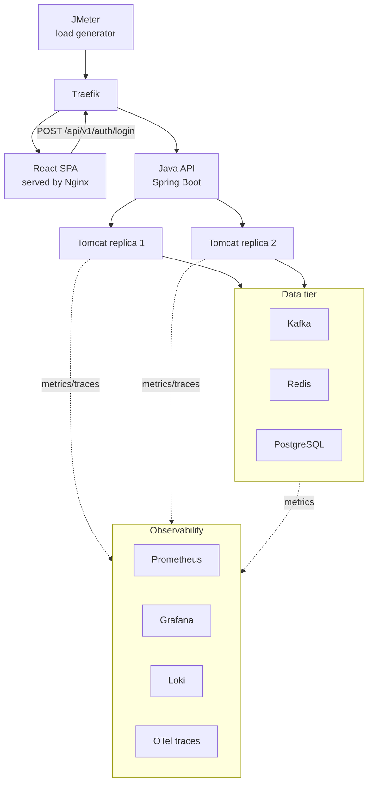

# grid-meter-app — Architecture

## Purpose

A smart-grid-meter simulation app built to demonstrate SRE/QA capability: app
lifecycle management, CI/CD pipelines, load testing, and observability
(metrics, logs, traces). Optimized to run entirely on a single 24GB MacBook
Air — every technology choice below was made with that constraint in mind.

## Scope

CRUDS (create, read, update, delete, search) on smart meters and their
readings. No billing calculation, no anomaly detection — kept intentionally
minimal so effort goes into infra/observability, which is what's being
demonstrated.

- `GET /api/meters?location=&status=`
- `GET /api/readings?meterId=&from=&to=&minValue=&maxValue=` (paginated)
- Standard CRUD on both resources
- Composite index on `(meter_id, reading_timestamp)` — the dominant query
  pattern, both from the API and from Redis cache-miss fallback

## System diagram

Every arrow into a Tomcat replica for `/api/v1/**` (from the SPA, from
JMeter, or from any other client) requires a JWT obtained via the login
call above — see "Authentication" below.

## Routing / edge tier

**Traefik is the single edge tool**, used both in Docker Compose (via its
Docker provider, reading labels off containers) and in the `kind` cluster
(via Kubernetes Ingress/IngressRoute). It handles:

- Path-based routing: `/` → static React build (served by Nginx), `/api/*` →
  the Spring Boot backend
- Load balancing across Tomcat replicas, with built-in health checks

HAProxy was considered and deliberately dropped — Traefik covers both jobs
(routing + load balancing) in one tool, avoiding redundant proxy hops and
keeping the edge story identical across dev (Compose) and demo (`kind`).

## Application layer (MVC + service layer)

Standard Spring Boot layering:

- **Controller** — thin, HTTP concerns only (request/response mapping,
  validation triggers)
- **Service** — business logic; orchestrates Kafka producer calls and Redis
  writes
- **Repository** — Spring Data JPA against PostgreSQL

## Authentication

Every `/api/v1/**` route requires a JWT — including `POST /readings`, the
endpoint JMeter hammers for load simulation. Full request/response
contract in `api-and-data-model.md`'s "Auth" section; the architectural
reasoning lives here.

- **JWT over server-side sessions.** This app runs 2 Tomcat replicas behind
  Traefik with no shared session store (see "Resource budget notes" below
  and `docker-compose.yml`'s `--scale api=2` support). A session-cookie
  approach would need sticky sessions or a shared session store (e.g.
  Redis-backed `Session`); a stateless JWT needs neither — any replica can
  validate any token independently, since validation is just a signature
  check against a shared secret.
- **This app issues its own tokens rather than validating an external
  IdP's.** `POST /api/v1/auth/login` is a self-contained login endpoint —
  there's no OAuth2/OIDC provider in this stack, so
  `spring-boot-starter-security` + a hand-written JWT filter is the
  standard pattern, not `spring-boot-starter-oauth2-resource-server`
  (which is shaped around validating tokens from an external authorization
  server via JWKS/issuer discovery — the wrong tool when the app itself
  *is* the issuer).
- **Access-token only, 60-minute TTL, no refresh token.** A refresh-token
  pair (a token table or Redis-backed revocation list, rotation logic) is
  real production complexity this project's own stated minimal-scope ethos
  argues against. 60 minutes covers an interactive demo session and a
  manual JMeter steady-state/ramp-up run comfortably; a token expiring
  mid-request just means re-authenticating via `/auth/login` — acceptable
  for a demo app, not acceptable for a production system with long-lived
  user sessions.
- **Client-side token storage is in-memory, not `localStorage`.** See
  "Frontend structure" below.
- **All-or-nothing protection, not a role model.** Every authenticated
  request carries one implicit `ROLE_USER` authority; there's no
  admin-vs-viewer split because nothing in this app's scope needs one yet.
  See `api-and-data-model.md`'s `User` entity note for the reasoning.

## Frontend structure

React SPA (Vite + React + TypeScript), client-side routed with React
Router, styled with MUI (Material UI — chosen over hand-written CSS or
Tailwind so effort goes into wiring the dashboard up to real data rather
than building UI primitives from scratch), server state managed with
TanStack Query (fits the app's actual shape: paginated REST endpoints,
Redis-backed caching upstream, a handful of mutations).

- **Pages**: a login page (public), and — behind a `ProtectedRoute` gate —
  a Meters page (search/filter, paginated table, create), a Meter detail
  page (view/edit, since meters aren't immutable like readings), and a
  read-only Readings page (search/filter only — readings are immutable
  events ingested via the API/JMeter, never hand-entered through the
  dashboard, matching the `PUT /readings/{id}` restriction in
  `api-and-data-model.md`).
- **Route protection is a UX nicety, not the security boundary.**
  `ProtectedRoute` redirecting an unauthenticated user to `/login` is
  client-side JavaScript — trivially bypassable by calling the API
  directly. The real boundary is `SecurityConfig` on the backend; the
  frontend gate exists purely so a logged-out user sees a login form
  instead of empty tables and failed requests.
- **Token storage: in-memory (a module-level store + React's
  `useSyncExternalStore`), not `localStorage`.** `localStorage` is a
  persistent, globally-enumerable store any XSS payload can sweep well
  after the payload itself executes; an in-memory value dies on tab
  close/refresh and leaves nothing durable to steal. Doesn't eliminate XSS
  risk entirely (a *live* payload can still read it), but meaningfully
  shrinks the exploit window. Accepted tradeoff: a hard browser refresh
  drops the session and requires re-login. The gold-standard fix (httpOnly
  cookies, invisible to JS entirely) would need SameSite/CSRF machinery
  that directly undoes the backend's "stateless bearer header, no CSRF
  needed" simplification — not worth it for this project.
- **No CORS needed.** Traefik routes `/` → frontend and `/api` → backend on
  the same origin (port 80) in both Docker Compose and `kind`, so the SPA
  calls relative `/api/...` paths in production. Local `npm run dev` uses a
  Vite dev-server proxy (`vite.config.ts`, targeting Traefik on
  `localhost:80`) instead of enabling Spring CORS, exercising the same
  `PathPrefix(/api)` routing used in production.

## Data flow

1. JMeter simulates meter reading submissions
2. Traefik routes `/api/*` traffic to a Tomcat replica
3. Controller → Service → publishes reading event to Kafka
4. A consumer writes the durable record to PostgreSQL and the latest reading
   to Redis
5. React dashboard reads current state from the API (Redis-backed for
   speed, PostgreSQL for historical/search queries)

## Data tier

| Component | Role |
|---|---|
| Kafka (KRaft mode, no ZooKeeper) | Async ingest of meter reading events |
| Redis | Cache of latest reading per meter |
| PostgreSQL | System of record; indexed for search/filter queries |

## Observability

| Signal | Tool | Notes |
|---|---|---|
| Metrics | Prometheus + Grafana | Scrapes Spring Boot Actuator/Micrometer `/actuator/prometheus` |
| Logs | Alloy → Loki | Alloy discovers containers via the Docker socket and ships logs to Loki. Promtail (the older agent) was removed upstream as of Loki 3.7.3, so Alloy is the only supported agent going forward. Same tool reused as a DaemonSet in the `kind` deployment. Loki chosen over OpenSearch for RAM footprint. |
| Traces | OpenTelemetry (Java agent) → Tempo | End-to-end trace: Traefik → Tomcat → Kafka → Postgres. Sampling defaults to 100% (`management.tracing.sampling.probability` in `application.yml`) — fine for normal dev, not for load-test throughput. Overridable via the `GRID_METER_TRACING_SAMPLING_PROBABILITY` env var, passed through in `docker-compose.yml`'s `api` service like the other `GRID_METER_*` settings — not a load-test-only mechanism, just a general Spring property override that load testing happens to be the first real consumer of. See `load-tests/README.md`. |
| Cluster/node metrics | `kube-prometheus-stack` (Helm) | Only piece of the stack installed via Helm — bundles node-exporter, kube-state-metrics, and pre-built dashboards |

## Deployment model

- **Docker Compose** — day-to-day development and debugging of the app
  itself; fast iteration, no cluster overhead.
- **`kind`** (Kubernetes-in-Docker) — the k8s demo for the interview. Spins
  up and tears down in under a minute on this hardware; a full multi-node
  cluster is not realistic on a laptop, and `kind` is an honest, standard
  way to demonstrate real k8s manifests without pretending otherwise.
  First slice is fully in-cluster — api, frontend, postgres, kafka, redis —
  rather than depending on the host's Compose stack for the data tier, so
  the demo is self-contained (`kind create cluster` + `kubectl apply -f
  k8s/`). Observability stack (`kube-prometheus-stack` and in-cluster
  Alloy/Loki/Tempo) is a deferred follow-up slice, not part of this pass.
- The app's own k8s manifests (Deployment, Service, ConfigMap) are plain
  YAML, not Helm — more legible for an interview walkthrough. Helm is
  reserved for `kube-prometheus-stack`, where its templating earns its
  keep.

### Terraform — explicitly out of scope

Considered as a future SRE-demo addition, but not adopted: this project's
entire deployment surface is local (Docker Compose for dev, `kind` for the
k8s demo), so there is no real cloud target for Terraform to provision.
Introducing it would mean inventing infrastructure to justify the tool
rather than the other way around — inconsistent with the project's
minimal-scope ethos elsewhere. Revisit only if a real cloud deployment
target is ever added to this project's actual scope.

## Resource budget notes (24GB MacBook Air)

- Kafka runs KRaft mode — removes a full separate ZooKeeper JVM.
- 2 Tomcat replicas is enough to demonstrate load balancing; no need for
  more.
- JMeter runs natively on the host, not containerized, so it isn't
  competing with the app stack for the same memory pool while generating
  load.
- Set explicit `-Xmx` per container — JVM heaps (2× Tomcat + Kafka + the app
  itself) are the dominant memory cost, and unbounded heaps risk OOM kills
  under load.

## CI/CD

- **GitHub Actions**: push/PR → build & test → build container image → push
  to registry → deploy to `kind` (or Compose) → verify via Grafana/Loki.
- **GitHub Issues** for bug tracking: labeled by severity/component, with an
  issue template capturing repro steps and expected/actual behavior. PRs use
  `Fixes #123` to link fixes back to reports, keeping a traceable bug →
  fix → deploy history.
