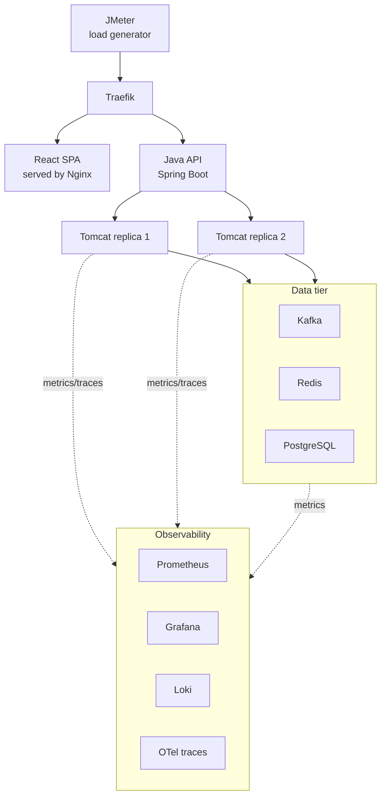

# grid-meter-app — Architecture

## Purpose

A smart-grid-meter simulation app built to demonstrate SRE/QA capability: app
lifecycle management, CI/CD pipelines, load testing, and observability
(metrics, logs, traces). Optimized to run entirely on a single 24GB MacBook
Air — every technology choice below was made with that constraint in mind.

## Scope

CRUDS (create, read, update, delete, search) on smart meters and their
readings. No billing calculation, no anomaly detection — kept intentionally
minimal so effort goes into infra/observability, which is what's being
demonstrated.

- `GET /api/meters?location=&status=`
- `GET /api/readings?meterId=&from=&to=&minValue=&maxValue=` (paginated)
- Standard CRUD on both resources
- Composite index on `(meter_id, reading_timestamp)` — the dominant query
  pattern, both from the API and from Redis cache-miss fallback

## System diagram

## Routing / edge tier

**Traefik is the single edge tool**, used both in Docker Compose (via its
Docker provider, reading labels off containers) and in the `kind` cluster
(via Kubernetes Ingress/IngressRoute). It handles:

- Path-based routing: `/` → static React build (served by Nginx), `/api/*` →
  the Spring Boot backend
- Load balancing across Tomcat replicas, with built-in health checks

HAProxy was considered and deliberately dropped — Traefik covers both jobs
(routing + load balancing) in one tool, avoiding redundant proxy hops and
keeping the edge story identical across dev (Compose) and demo (`kind`).

## Application layer (MVC + service layer)

Standard Spring Boot layering:

- **Controller** — thin, HTTP concerns only (request/response mapping,
  validation triggers)
- **Service** — business logic; orchestrates Kafka producer calls and Redis
  writes
- **Repository** — Spring Data JPA against PostgreSQL

## Data flow

1. JMeter simulates meter reading submissions
2. Traefik routes `/api/*` traffic to a Tomcat replica
3. Controller → Service → publishes reading event to Kafka
4. A consumer writes the durable record to PostgreSQL and the latest reading
   to Redis
5. React dashboard reads current state from the API (Redis-backed for
   speed, PostgreSQL for historical/search queries)

## Data tier

| Component | Role |
|---|---|
| Kafka (KRaft mode, no ZooKeeper) | Async ingest of meter reading events |
| Redis | Cache of latest reading per meter |
| PostgreSQL | System of record; indexed for search/filter queries |

## Observability

| Signal | Tool | Notes |
|---|---|---|
| Metrics | Prometheus + Grafana | Scrapes Spring Boot Actuator/Micrometer `/actuator/prometheus` |
| Logs | Alloy → Loki | Alloy discovers containers via the Docker socket and ships logs to Loki. Promtail (the older agent) was removed upstream as of Loki 3.7.3, so Alloy is the only supported agent going forward. Same tool reused as a DaemonSet in the `kind` deployment. Loki chosen over OpenSearch for RAM footprint. |
| Traces | OpenTelemetry (Java agent) → Tempo | End-to-end trace: Traefik → Tomcat → Kafka → Postgres |
| Cluster/node metrics | `kube-prometheus-stack` (Helm) | Only piece of the stack installed via Helm — bundles node-exporter, kube-state-metrics, and pre-built dashboards |

## Deployment model

- **Docker Compose** — day-to-day development and debugging of the app
  itself; fast iteration, no cluster overhead.
- **`kind`** (Kubernetes-in-Docker) — the k8s demo for the interview. Spins
  up and tears down in under a minute on this hardware; a full multi-node
  cluster is not realistic on a laptop, and `kind` is an honest, standard way
  to demonstrate real k8s manifests without pretending otherwise.
- The app's own k8s manifests (Deployment, Service, ConfigMap) are plain
  YAML, not Helm — more legible for an interview walkthrough. Helm is
  reserved for `kube-prometheus-stack`, where its templating earns its
  keep.

## Resource budget notes (24GB MacBook Air)

- Kafka runs KRaft mode — removes a full separate ZooKeeper JVM.
- 2 Tomcat replicas is enough to demonstrate load balancing; no need for
  more.
- JMeter runs natively on the host, not containerized, so it isn't
  competing with the app stack for the same memory pool while generating
  load.
- Set explicit `-Xmx` per container — JVM heaps (2× Tomcat + Kafka + the app
  itself) are the dominant memory cost, and unbounded heaps risk OOM kills
  under load.

## CI/CD

- **GitHub Actions**: push/PR → build & test → build container image → push
  to registry → deploy to `kind` (or Compose) → verify via Grafana/Loki.
- **GitHub Issues** for bug tracking: labeled by severity/component, with an
  issue template capturing repro steps and expected/actual behavior. PRs use
  `Fixes #123` to link fixes back to reports, keeping a traceable bug →
  fix → deploy history.
